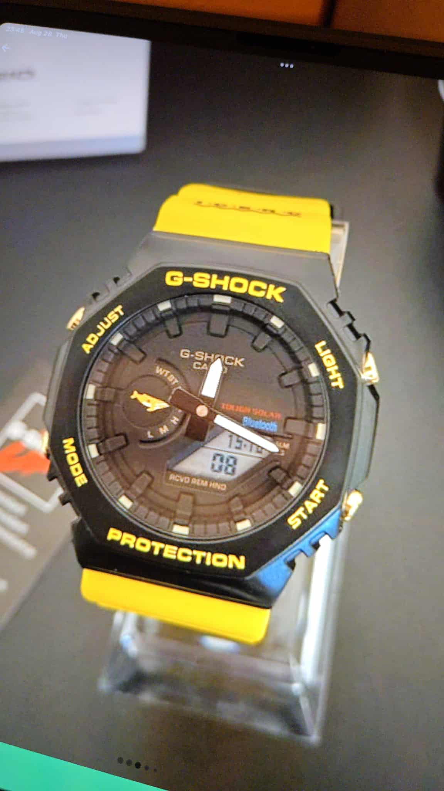
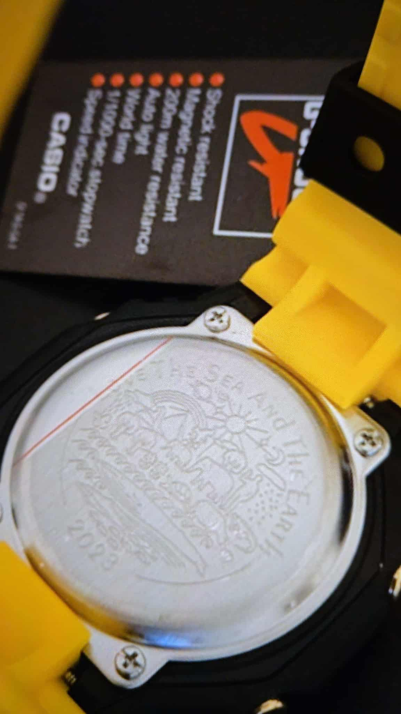
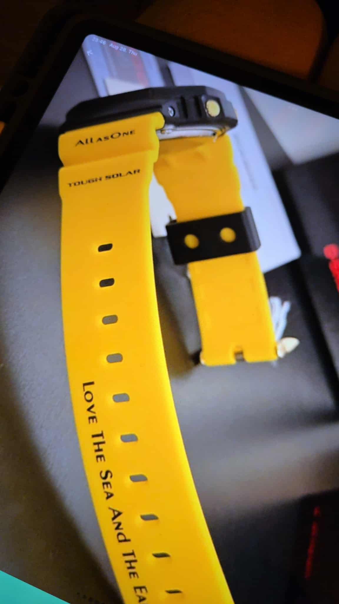

## 🕵️‍♂️ Treasure Hunting on Vinted: How I Scored a Rare G-Shock GA-B2100 ICERC Edition

### The Thrill of the Hunt

I’ve been playing a new kind of game lately: digital treasure hunting.
Instead of flea markets or garage sales, I go digging on Vinted. I have been using Vinted for a while and 
if you go for not so obvious highstreet brands (like my favourite Scotch and Soda) you can get great quality for the money.
Recently for me, the sweet spot is Casio G-Shocks. I love those watches. They’re built like tanks but there is 
something important about them. I don't know them well enough. So deciding about value and authenticity is sometimes out of my expertise.
Yesterday for example I found a brutally cheap Japanese special edition and by the time I figured that it's sold for 1/5th of it's value, it 
was already gone. 

That's when I realised, that there is help on my phone, who should search faster and know better how to spot fake from real and bargain from rip-off. Minus the hallucinations, but worth a try.

### My Secret Weapon: ChatGPT

I don’t hunt alone anymore. I use ChatGPT as my “advisor”, almost like a savvy friend who knows specs, prices, and the tricks for spotting fakes. 
I’ll snap a photo or paste a listing, and in seconds I’ve got a full authenticity check, market value, and negotiation strategy.
It’s like having a collector buddy whispering in my ear: __“That’s a steal, grab it now” or “Careful, might be a fake.”__

### The Find: GA-B2100 “Love The Sea And The Earth”

One of my proudest catches came soon. A Casio G-Shock GA-B2100 ICERC 2023 Limited Edition.
    
    - Bright yellow strap with “Love The Sea And The Earth” printed on it.

    - Tough Solar + Bluetooth technology.

    - Special whale/dolphin motif on the dial and engraved on the case back.

    - A collector’s piece that usually goes for 90–100k HUF — but I found mine for a fraction of that.

This wasn’t just a random watch. 
It’s part of Casio’s environmental collaboration with ICERC (International Cetacean Education and Research Centre), produced in limited runs every year. 
It’s rare, bold, and collectible.

I am still negotiating for a rugged GW-7900 daily beater solar atomic with Multi-Band 6 and Tide/Moon graph from the G-Rescue series.

This is so much fun that I am thinking about automating it just for the heck of it and release my G-Sentinel AI agent to hunt for me. If it happens, will share the process here.

